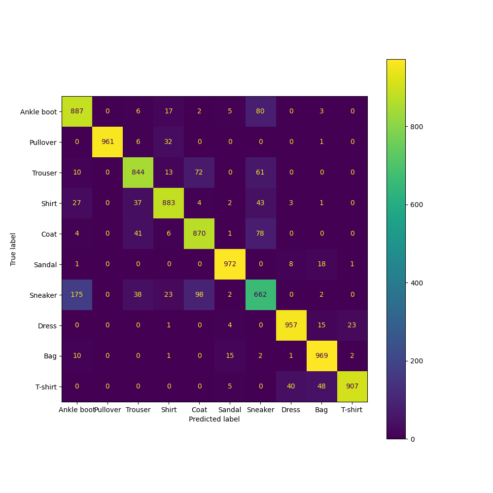

# Fashion-MNIST dataset training

## Information bottleneck

Information bottleneck layer is a penultimate layer in layer chain.
Training model with 10 classes, 10 samples per class, plot information bottleneck points.

We can see that points model is "developing" and points are moving away from the center.

## Confusion matrix

Confusion matrix diagonally predominates, but `Sneakers` value is lower than it is expected,
because they are sometimes predicted as `Ankle boots`, which is normal from human's point of view.

## Hard-negatives (top-5 samples for each class with maximum softmax confidence of misclass)

|    Class   |                                    top-1                                    |                                top-2                                |                                    top-3                                    |                                    top-4                                    |                                top-5                               |
|:----------:|:---------------------------------------------------------------------------:|:-------------------------------------------------------------------:|:---------------------------------------------------------------------------:|:---------------------------------------------------------------------------:|:------------------------------------------------------------------:|
| Ankle boot |    .png) (Sneaker)    |  .png) (Sandal) |    .png) (Sneaker)    |    .png) (Sneaker)    | .png) (Sandal) |
|     Bag    |         .png) (T-shirt)        |        .png) (Dress)       |          .png) (Sandal)          |         .png) (T-shirt)        |    .png) (T-shirt)    |
|    Coat    |       .png) (Pullover)      |       .png) (Dress)       |           .png) (Shirt)           |           .png) (Shirt)           |       .png) (Dress)      |
|    Dress   |        .png) (T-shirt)       |    .png) (T-shirt)   |      .png) (Pullover)      |      .png) (Pullover)      |  .png) (Pullover) |
|  Pullover  |           .png) (Coat)          |       .png) (Coat)      |           .png) (Coat)          |      .png) (T-shirt)      |      .png) (Coat)      |
|   Sandal   |       .png) (Sneaker)       |   .png) (Sneaker)   |       .png) (Sneaker)       |             .png) (Bag)             |         .png) (Bag)        |
|    Shirt   |        .png) (T-shirt)       |    .png) (T-shirt)   |            .png) (Coat)            |        .png) (T-shirt)       |        .png) (Coat)       |
|   Sneaker  | .png) (Ankle boot) |    .png) (Sandal)    | .png) (Ankle boot) | .png) (Ankle boot) |        .png) (Bag)        |
|   T-shirt  |     .png) (Pullover)     | .png) (Pullover) |          .png) (Dress)         |          .png) (Dress)         |    .png) (Sandal)   |
|   Trouser  |          .png) (Dress)         |      .png) (Dress)     |          .png) (Dress)         |          .png) (Dress)         |     .png) (Dress)     |

We can see that all mispredicted samples are very similar to the true ones, for example:
    * `Ankle boots` to `Sneakers`,  to `Sandals` to `Sneakers`.
    * `Pullover` to `Coat`, `Dress` to `Pullover`, `Coat` to `Pullover` and `Shirt`
    * `Trousers` to `Dress`.
    * `Bag` is predicted both as `T-shirt`, `Dress`, `Sandals`, etc, due to unusual shape in comparison with other classes.